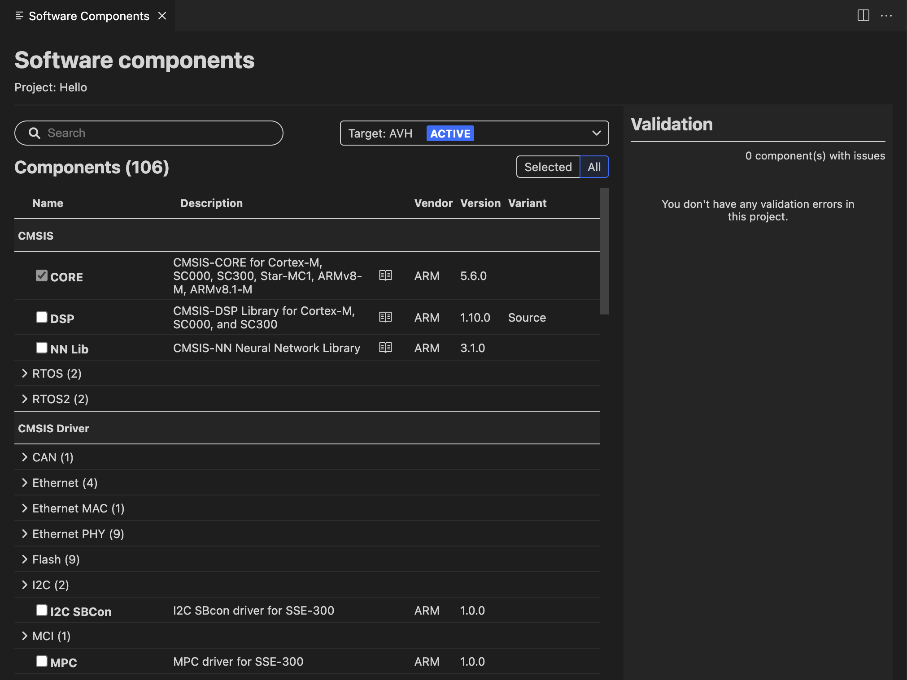
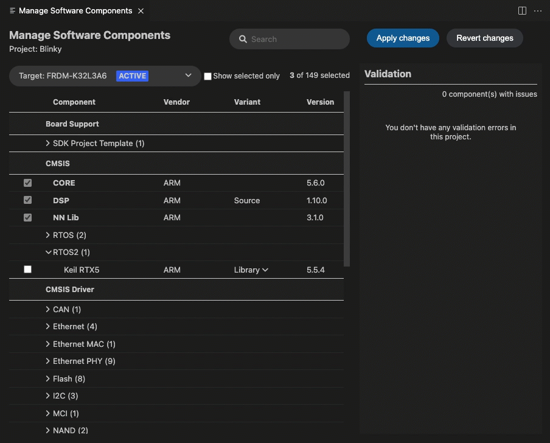

# Arm CMSIS csolution

## Overview

This extension provides support for working with CMSIS solutions (csolution projects). It can be installed individually or together with other extensions contained in the **Keil Studio Pack** available for Visual Studio Code Desktop. Check the extension pack Readme first if you want to install the extensions using the pack.

The **Arm CMSIS csolution** extension can work in combination with the **Arm Device Manager** (Identifier: `arm.device-manager`) and **Arm Embedded Debugger** (Identifier: `arm.embedded-debug`) extensions.

This Readme explains how to set up your development environment to be able to work with CMSIS solutions in Visual Studio Code.

Once your development environment is ready, you can clone a csolution example project, install the CMSIS-Packs required for the example, and then start working with the example.

Note that you can convert a Keil MDK project in `.uvprojx` format to a csolution project from the **Arm CMSIS csolution** extension as explained in this Readme.

For more information about supported hardware for CMSIS projects, go to [keil.arm.com](https://www.keil.arm.com/boards/). For an overview on CMSIS-Packs, go to [open-cmsis-pack.org](https://www.open-cmsis-pack.org/index.html).

## Submit feedback

To submit feedback, please [create an issue](https://github.com/Arm-Software/vscode-cmsis-csolution/issues/new/choose).

## Table of contents

1. [Set up your development environment](#set-up-your-development-environment)
    - [General comments](#general-comments)
    - [Install the tools](#install-the-tools)
    - [Initialize or update the catalog of public CMSIS-Pack versions](#initialize-or-update-the-catalog-of-public-cmsis-pack-versions)
    - [Install and set up the clangd extension](#install-and-set-up-the-clangd-extension)
    - [Modify extension settings](#modify-extension-settings)
1. [Work with a csolution example project](#work-with-a-csolution-example-project)
1. [Convert a Keil MDK project to a csolution project](#convert-a-keil-mdk-project-to-a-csolution-project)
1. [Create a csolution project](#create-a-csolution-project)
1. [Manage a csolution project and its software components](#manage-a-csolution-project-and-its-software-components)
1. [Troubleshooting](#troubleshooting)
1. [Known limitations](#known-limitations)

## Set up your development environment

Here are the main steps:

1. Install the following tools:
    - [Compiler toolchain](#install-a-compiler-toolchain).
    - [CMake and Ninja](#install-cmake-and-ninja).
    - [CMSIS-Toolbox](#install-the-cmsis-toolbox).

1. [Initialize or update the catalog of public CMSIS-Pack versions](#initialize-or-update-the-catalog-of-public-cmsis-pack-versions).

1. [Install and set up the clangd extension](#install-and-set-up-the-clangd-extension).

1. [Modify extension settings](#modify-extension-settings).

### General comments

#### On macOS

Some unsigned binaries need to be de-quarantined before you can run them. This is only required for newer versions of macOS.

Run the command from the terminal:

```
xattr -d com.apple.quarantine /path/to/bin
```

Run with `sudo` if you get permission errors.

#### On Windows

Use the **System Properties** dialog box to set environment variables and add directories to the PATH.

### Install the tools

#### Install a compiler toolchain

Install the Arm Compiler for Embedded toolchain or the Arm GNU Toolchain (includes the GNU Compiler - GCC), or both.

##### Install the Arm Compiler for Embedded toolchain

On Windows or Linux, download Arm Compiler for Embedded version 6.18 from [Arm Developer](https://developer.arm.com/downloads/-/arm-compiler-for-embedded) or use the Arm Compiler for Embedded toolchain available with [Keil MDK](https://www2.keil.com/mdk5).

**Note**: There is no build available for macOS at the moment.

##### Install the Arm GNU Toolchain (GCC)

1. Download the Arm GNU Toolchain version 11.2 from
[Arm Developer](https://developer.arm.com/downloads/-/arm-gnu-toolchain-downloads). Choose the **arm-none-eabi** release for your platform.

    Archive files are available for all platforms. Installers are available for macOS and Windows.

1. To check if the ARM GNU Toolchain was installed, navigate to the `<arm-toolchain-installation-dir>/bin/` directory.
2. Check the installation by running the following command from the terminal:

```
arm-none-eabi-g++ --help
```

#### Install CMake and Ninja

The CMSIS-Toolbox uses the CMake build system with a Ninja generator, so you must install these tools before installing CMSIS-Toolbox.

1. Install the CMake and Ninja build tools with your system package manager or download the latest releases from the CMake and Ninja download pages.

    - Installation with a system package manager:

      Example with Homebrew on macOS:

```
brew install cmake
brew install ninja
```

    - Installation from latest releases:

      - Download the CMake installer from here: https://cmake.org/download/
      - Download the Ninja executable from here: https://github.com/ninja-build/ninja/releases

1. If this has not already been handled by the system package manager, add `cmake` and `ninja` to the PATH.

1. Check the installation by running the following commands from the terminal:

```
cmake --version
ninja --version
```

#### Install the CMSIS-Toolbox

1. Download the latest release of CMSIS-Toolbox for your platform from the
[Releases](https://github.com/Open-CMSIS-Pack/cmsis-toolbox/releases) page on GitHub.

    **Note**: There is no Apple silicon build available yet, but the **darwin64** version works with [Rosetta](https://developer.apple.com/documentation/apple-silicon/about-the-rosetta-translation-environment).

1. Extract the content of the archive file.

1. Modify the `*.cmake` file for the compiler toolchain you have installed. If you have several toolchains installed, modify the corresponding `*.cmake` files. All the `*.cmake` files are stored in `<cmsis-toolbox-installation-dir>/etc/`.

    For example, modify the section below:

```
############### EDIT BELOW ###############
# Set base directory of toolchain
set(TOOLCHAIN_ROOT "/home/runner/gcc-arm-none-eabi-10-2020-q4-major/bin")
set(TOOLCHAIN_VERSION "11.2.1")
```

    As follows:

```
############### EDIT BELOW ###############
# Set base directory of toolchain
set(TOOLCHAIN_ROOT "/Applications/ARM/bin")
set(TOOLCHAIN_VERSION "11.2.1")
```

    **Notes**:
    - The exact toolchain version does not matter. For example, you can modify the `GCC.10.2.1.cmake` file if you have installed GCC 10.3.1.
    - `TOOLCHAIN_ROOT` should be set to the _absolute_ path to the compiler bin directory where the toolchain binaries are stored.
    - `EXT` gives the file extension of the executable binaries. Leave it empty for macOS and Linux. Use `.exe` for Windows.

1. Set the following environment variables:

    - `CMSIS_COMPILER_ROOT`: Set to the path of the CMSIS-Toolbox `etc` directory. For example, `/<cmsis-toolbox-installation-dir>/etc`.
    - `PATH`: Add the CMSIS-Toolbox `bin` directory to the system path. For example, `/<cmsis-toolbox-installation-dir>/bin`.
    - `CMSIS_PACK_ROOT`: Set to the path of the CMSIS-Pack root directory that stores software packs. This can be any directory, but do not leave it undefined. If you had installed the CMSIS-Toolbox previously, or if you are a Keil MDK user, the default location for packs is `$HOME/.cache/arm/packs` on Mac or Linux and `%HOME%\AppData\Local\Arm\Packs` on Windows.

1. Configure an HTTP proxy (optional):

    This step is only required if you are working behind an HTTP proxy. The tools can be configured using the following standard environment variables to use an HTTP proxy:

    - `HTTP_PROXY`: Set to the proxy used for HTTP requests.
    - `HTTPS_PROXY`: Set to the proxy used for HTTPS requests.
    - `NO_PROXY`: Set to include at least `localhost,127.0.0.1` to disable the proxy for internal traffic (which is required for the extension to work correctly).

1. On macOS:

    The CMSIS-Toolbox is currently not signed, so you must de-quarantine its binaries as explained in the [General comments](#general-comments) section.

    Run the command from the terminal:

```
xattr -d com.apple.quarantine <cmsis-toolbox-installation-dir>/bin/
```

    *Example*: `> $xattr -d com.apple.quarantine <cmsis-toolbox-installation-dir>/path/to/bin/cbuild`.

    Run with `sudo` if you get permission errors.

    Alternatively, if the command fails, execute the binaries located in `<cmsis-toolbox-installation-dir>/path/to/bin` individually and give them permission from system preferences.

1. Check the installation with:

```
cbuild --version
csolution --help
```

### Initialize or update the catalog of public CMSIS-Pack versions

If `CMSIS_PACK_ROOT` is pointing to an empty directory, run the following command from the terminal to initialize the directory structure and download the latest pack index file:

```
cpackget init https://www.keil.com/pack/index.pidx
```

Otherwise, run the following command from the terminal to update the stored catalog (index file and the already downloaded package description files):

```
cpackget update-index
```

### Install and set up the clangd extension

Install the **clangd** extension from Visual Studio Code.

The **clangd** extension requires the clangd language server. If the server is not found on your path, add it with the **clangd: Download language server** command from the Command Palette. Check the clangd extension Readme for more information.

### Modify extension settings

#### Modify settings to point at CMSIS-Toolbox

**Note**: If you have not already installed the **Arm CMSIS csolution** extension with the **Keil Studio Pack**, install the extension individually.

Modify the extension settings to point at the tools installed previously.

**Note**: This is unnecessary if you add the toolbox bin directory to the PATH.

1. In Visual Studio Code, open the Settings:
    - On Windows or Linux, go to: **File** > **Preferences** > **Settings**.
    - On macOS, go to: **Code** > **Settings** > **Settings**.

1. Find the **Cmsis-csolution: Cbuild Path** and **Cmsis-csolution: Csolution Path** settings and set _absolute_ paths for:
    - The `cbuild` executable (available in the CMSIS-Toolbox **bin** directory) in **Cbuild Path**.
    - The `csolution` executable (available in the CMSIS-Toolbox **bin** directory) in **Csolution Path**.

1. Restart Visual Studio Code.

#### C/C++ language support with clangd

There is no extra setup needed once **clangd** has been installed. The **Arm CMSIS csolution** extension generates a `compile_commands.json` file for each project in a solution whenever a `.cprj` file changes or when you change the context of a solution (**Target** and **Build** types). A `.clangd` file is kept up to date for each project in the solution. The `.clangd` file is used by the **clangd** extension to locate the `compile_commands.json` files and enable IntelliSense. See the [clangd documentation](https://clangd.llvm.org/installation#project-setup) for more details.

You can turn off the automatic generation of the `.clangd` file and `compile_commands.json` file.

1. Open the Settings:
    - On Windows or Linux, go to: **File** > **Preferences** > **Settings**.
    - On macOS, go to: **Code** > **Settings** > **Settings**.

1. Find the **Cmsis-csolution: Auto Generate Clangd File** and **Cmsis-csolution: Auto Generate Compile Commands** settings and clear their checkboxes.

## Work with a csolution example project

Now that your Visual Studio Code environment is set up, you can start working with a csolution project. You must clone an example project, install the CMSIS-Packs for the example, and then set a context.

Once you have explored what you can do with the csolution example project, check the "Tutorial" section in the Keil Studio Pack for Visual Studio Code Desktop Readme. The Tutorial explains how to connect your board, flash the csolution to your board, and launch a debug session.

### Clone a csolution example project

Clone the example project available in the following repository:

https://github.com/Open-CMSIS-Pack/csolution-examples

To clone a project in Visual Studio Code:

1. Go to **View** > **Command Palette...**.

1. In the field that opens at the top of the window, type `Git`, then select the **Git:Clone** command in the drop-down list.

1. Copy and paste the GitHub repository URL provided in the field that displays and press **Enter**.

    A dialog box opens to select where to clone the repository.

1. Select a location.

    Once the repository is cloned, open the example project in Visual Studio Code.

### Install the CMSIS-Packs required for the example

Install the CMSIS-Packs.

1. Open the cloned example project from Visual Studio Code, then open the `Hello.csolution.yml` file from the **Explorer** view.

    The required packs are listed under the `packs` key of the `csolution.yml` file.
    For example, one of the required packs for `Hello.csolution.yml` is `ARM::V2M_MPS3_SSE_300_BSP@1.2.0`, where `ARM` is the vendor, `V2M_MPS3_SSE_300_BSP` is the name of the pack, and `1.2.0` is the version.

1. Run the following command from the terminal to add the packs:

```
cpackget add <vendor>::<name>@<version>
```
      Note that you can add multiple packs at once as follows:

```
cpackget add <vendor>::<name>@<version> <vendor>::<name>@<version> <vendor>::<name>@<version>
```

### Explore what you can do with the csolution example project

Look at the csolution contexts.

1. Click the **CMSIS** icon  in the Activity Bar to open the **Arm CMSIS csolution** extension.

1. Look at the available contexts for the csolution in the **CONTEXT** panel. You can change the target type (build target) and build configuration.

    - **Active Solution**: The name of the active csolution, `Hello` (`Hello.csolution.yml`).
    - **Target Type**: The build target `AVH` (Arm Virtual Hardware). For more details on Arm Virtual Hardware, check the [product overview](https://arm-software.github.io/AVH/main/overview/html/index.html). Note that for this example you can only select `AVH` and it corresponds to the Arm Corstone SSE-300 model. Some examples are compatible with physical evaluation boards as well, so you can have more options in the drop-down list in that case.
    - **Build Type**: The build configuration `Debug` or `Release`. A build configuration adds the flexibility to configure each target type towards a specific testing. Use `Debug` for a full debug build of the software for interactive debug, or `Release` for the final code deployment to the systems.
    - **Project**: The name of the cproject, `Hello` (`Hello.cproject.yml`).

1. Click the **Explorer** icon  and open the `Hello.csolution.yml` and `Hello.cproject.yml` files. YAML syntax support helps you with editing.

1. The `.cprj` file is regenerated when changes are made to the `csolution.yml` or `cproject.yml` files.

        1. Go to **View** > **Output**.

            The **OUTPUT** tab opens.

        1. Select **CMSIS Project Manager** in the drop-down list in the top right corner and check what has been logged.

1. Go the **PROBLEMS** tab and check for errors.

1. Right-click the `.cprj` file corresponding to the context you selected and select **Build**.

    **Note**: A **Rebuild** option is also available in the right-click menu. This option cleans output directories before building the project. **Build** and **Rebuild** can also be triggered from the Command Palette with the **CMSIS: Build** and **CMSIS: Rebuild** commands.

1. Check the **TERMINAL** tab.

1. Open the `Hello.c` file and check the IntelliSense features available. Check the Visual Studio Code documentation on [IntelliSense](https://code.visualstudio.com/docs/editor/intellisense) to find out about the different features.


**Note**: You can turn off the automatic generation of the `cprj` file.

  1. Open the Settings:
    - On Windows or Linux, go to: **File** > **Preferences** > **Settings**.
    - On macOS, go to: **Code** > **Settings** > **Settings**.

  1. Find the **Cmsis-csolution: Auto Generate Cprj** setting and clear its checkbox.

## Convert a Keil MDK project to a csolution project

You can convert a Keil MDK project to csolution project from the **Arm CMSIS csolution** extension.

1. In Visual Studio Code, run the **CMSIS: Convert MDK project to csolution** command from the Command Palette.

1. Using the file picker that displays, select the `.uvprojx` that you want to convert and click **Select**.

    The conversion starts immediately.

1. Check the **OUTPUT** tab (**View** > **Output**). Conversion messages are logged under the **MDK to csolution Converter** category.

    A "Conversion Successful" message displays once the conversion is done.
    The `*.cproject.yaml` and `*.csolution.yaml` files are available in the folder where the `.uvprojx` is stored.

## Create a csolution project

**Note**: The **New CMSIS solution** view is still under development. To get access to it, select the **Cmsis-csolution: Experimental Features** checkbox in the settings.

Create a CMSIS solution which contains an empty CMSIS project.

1. Before you can create a CMSIS solution, you must open a workspace in Visual Studio Code. Select **File** > **Open Folder...**. Use the system dialog box that opens to create and select a new folder to store your solution.

1. Click the **CMSIS** icon  in the Activity Bar to open the **Arm CMSIS csolution** extension.

1. Hover over the **CONTEXT** label and click the **Create a solution** icon .

    The **New CMSIS solution** view opens.

1. Click the **Target** drop-down list and select a device or a board from the lists available.

    The **Target type** field is automatically populated with `Device` or `Board` depending on what you selected in the **Target** drop-down list. You can edit the value if you need.

1. In the **Project name** and **Solution name** fields, type a project name and a solution name.

1. Check the **Solution preview**. This displays the solution name and the project name, as well as the target hardware selected for the solution, the compiler, and the build types available.

1. Check the default options:

    - **Initialize Git repo**: The extension initializes the solution as a Git repository. Clear the checkbox if you do not want to turn your solution into a Git repository.

    - **Make project active**: The extension sets the newly created project that is part of the new solution as the active project. **Build**, **Flash** and **Debug** actions only apply to the active project. Clear the checkbox if you do not want to make the new project active.

1. Click **Create**. Keil Studio creates the solution in your workspace.

1. Click the **Explorer** icon  in the Activity Bar to check the files that have been created.

1. Open the entry for the folder you created **<folder_name>**.

    A `<solution_name>.csolution.yaml` and a `<project_name>.cproject.yaml` files are created under a **<solution_name>** entry.

### Next steps

Explore the autocomplete feature available to edit the `csolution.yaml` and `cproject.yaml`.
Check the [csolution: CMSIS Project Manager](https://github.com/Open-CMSIS-Pack/devtools/blob/main/tools/projmgr/docs/Manual/Overview.md#project-examples) documentation for project examples.

Add CMSIS components with the **Software Components** view. When you add components the `cproject.yaml` file is updated.

## Manage a csolution project and its software components

The **Software Components** view shows all the software components selected in the active project of a CMSIS solution. From this view you can see all the component details (called attributes in the [Open-CMSIS-Pack documentation](https://open-cmsis-pack.github.io/Open-CMSIS-Pack-Spec/main/html/cp_PackTutorial.html#cp_SWComponents)).
You can also:
- Modify the software components to include in the project and manage the dependencies between components for each target type (build target) you have defined in your solution.
- Build the solution using different combinations of pack and component versions, and different versions of a toolchain.

### Open the Software Components view

1. In Visual Studio Code, open the solution you want to work on.

1. Click the **CMSIS** icon  in the Activity Bar to open the **Arm CMSIS csolution** extension.

1. Check the active project selected in the **CONTEXT** panel.

1. Hover over the **CONTEXT** label and click the **Manage software components** icon .

    The **Software Components** view opens.

By default, the view displays the components included in the active project only (**Selected** toggle button). If you click the **All** toggle button, all the components available for use display.



With the **Target** drop-down list, you can select components for the different target types (build targets) you have in your solution.

The first column in the **Software Components** view shows how many instances of the component are deployed in the project. If the component has a selected checkbox, one instance is deployed. If the checkbox is not selected, it is not deployed in the project. If a number input displays, multiple instances of this component can be deployed to a project.

The CMSIS-Pack specification states that each software component should have the following attributes:

- Component class (Cclass): A top-level component name. For example: **CMSIS**. For a full list of component classes, see [Software Component Cclasses](https://arm-software.github.io/CMSIS_5/Pack/html/cp_Packs.html#pack_Cclass) in the Open-CMSIS-Pack documentation.
- Component group (Cgroup): A component group name. For example: **CORE** for the **CMSIS** component class.
- Component version (Cversion): The version number of the software component.

Optionally, a software component might have these additional attributes:

- Component sub-group (Csub): A component sub-group that is used when multiple compatible implementations of a component are available. For example: **Keil RTX5** implements **CMSIS &gt; RTOS2**.
- Component variant (Cvariant): A variant of the software component is typically used when the same implementation has multiple top-level configurations, like **Source** for **RTOS2 > Keil RTX5**.
- Component vendor (Cvendor): The supplier of the software component. For example: **Keil**.
- Bundle (Cbundle): Allows you to combine multiple software components into a software bundle. Bundles have a different set of components available. All the components in a bundle are compatible with each other but not with the components of another bundle. For example: **ARM Compiler** for the **Compiler** component class.

Documentation links are available for some components. Click the book icon  of a component to open the related documentation.

Use the **Search** field, to search on the component groups and sub-groups.

### Modify the software components in your project

You can add components from all the packs available (it is not limited to the packs that are already selected for a given project).

1. Click the **All** toggle button to display all the components available.

1. Select a target type (build target) in the **Target** drop-down list. You can select components for the different target types defined in the solution.

1. Use the checkboxes to select or clear components as required. If a number input displays instead of a checkbox, it means that multiple instances of this component can be deployed to a project. For some components, you can also select a vendor, variant, or version.

    The `cproject.yaml` file is automatically updated.

1. Manage the dependencies between components and solve validation issues from the **Validation** panel.

    Issues are highlighted in red and have an exclamation mark icon  next to them. You can remove conflicting components from your selection or add missing component dependencies from a suggested list.

1. If there are validation issues, hover over the issues in the **Validation** panel to get more details. You can click the proposed fixes to find the components in the list. In some cases, you may have to choose between different fix sets. Select a fix set in the drop-down list, apply the changes, and then click **Apply**.

    

    If a pack is missing in the solution, a message "Component's pack is not included in your solution" displays. Click **Apply** to add the pack to the solution. Note that it does not install the missing pack. You must install the pack separately. When presented with multiple pack options, select one pack and click **Apply**.

    There can be other cases such as:
    - A component you selected is incompatible with the selected device and toolchain.
    - A component you selected has dependencies which are incompatible with the selected device and toolchain.
    - A component you selected has unresolvable dependencies.
    In such cases, you must remove the component. Click **Apply** from the **Validation** panel.

**Note**: In the current version, you can undo changes from the **Source Control** view or by directly editing the `cproject.yaml` file.

## Troubleshooting

### Build fails to find toolchain

Errors such as `ld: unknown option: --cpu=Cortex-M4` appear in the build output. In this example, the CMSIS-Toolbox is trying to use the system linker rather than Arm Compiler's armlink.

1. Ensure the `CMSIS_COMPILER_ROOT` environment variable is set correctly. You may need to restart Visual Studio Code so it picks up the new environment.

1. Clean the solution. In particular, delete the `out` and `tmp` directories.

1. Run the build again.

## Known limitations

This extension is currently a preview. Known limitations include:

- No support for cdefaults.yml and clayer.yml files, for example target and build types from the cdefaults file do not appear in the **CONTEXT** view.
