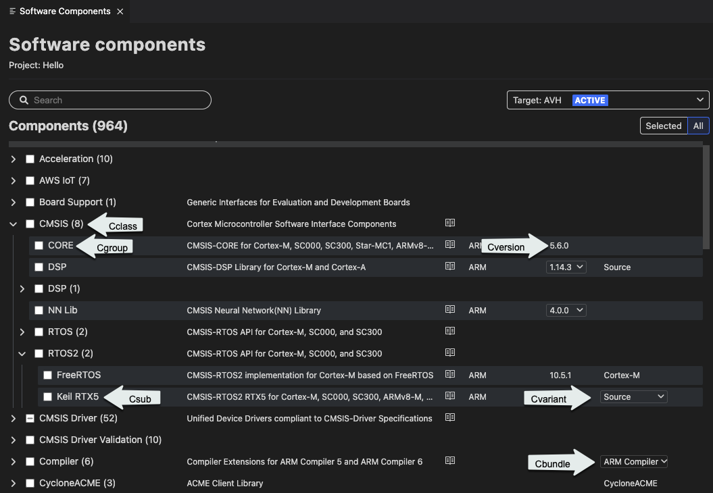

# Arm CMSIS csolution

## Overview

This extension provides support for working with CMSIS solutions (csolution projects). It can be installed individually or together with other extensions contained in the **Keil Studio Pack** available for Visual Studio Code Desktop. Check the extension pack Readme first if you want to install the extensions using the pack.

The **Arm CMSIS csolution** extension can work with the **Arm Device Manager** (Identifier: `arm.device-manager`) and **Arm Embedded Debugger** (Identifier: `arm.embedded-debug`) extensions.

This Readme explains how to set up your development environment to be able to work with CMSIS solutions in Visual Studio Code.

Once your development environment is ready, you can clone a csolution example project, install the CMSIS-Packs required, and then start working with the example.

Note that you can convert a Keil μVision project in `.uvprojx` format to a csolution project from the **Arm CMSIS csolution** extension as explained in this Readme.

For more information about supported hardware for CMSIS projects, go to [keil.arm.com](https://www.keil.arm.com/boards/). For an overview on CMSIS-Packs, go to [open-cmsis-pack.org](https://www.open-cmsis-pack.org/index.html).

## Submit feedback

To submit feedback, please [create an issue](https://github.com/Arm-Software/vscode-cmsis-csolution/issues/new/choose).

## Table of contents

1. [Set up your development environment](#set-up-your-development-environment)
    - [Install the tools using Microsoft vcpkg](#install-the-tools-using-microsoft-vcpkg)
    - [Configure an HTTP proxy (optional)](#configure-an-http-proxy-(optional))
    - [Install and set up the clangd extension](#install-and-set-up-the-clangd-extension)
1. [Work with a csolution example project](#work-with-a-csolution-example-project)
1. [Convert a Keil μVision project to a csolution project](#convert-a-keil-μVision-project-to-a-csolution-project)
1. [Create a csolution project](#create-a-csolution-project)
1. [Manage a csolution project and its software components](#manage-a-csolution-project-and-its-software-components)
1. [Troubleshooting](#troubleshooting)
1. [Known limitations](#known-limitations)

## Set up your development environment

Here are the main steps:

1. [Install the following tools using Microsoft vcpkg](#install-the-tools-using-microsoft-vcpkg):
    - Arm GNU Toolchain (includes the GNU Compiler - GCC). The **arm-none-eabi-gcc** release will be installed.
    - CMSIS-Toolbox (ctools).
    - CMake and Ninja. The CMSIS-Toolbox uses the CMake build system with a Ninja generator.

1. [Configure an HTTP proxy (optional)](#configure-an-http-proxy-(optional)).

1. [Install and set up the clangd extension](#install-and-set-up-the-clangd-extension).

### Install the tools using Microsoft vcpkg

Arm recommends using [Microsoft vcpkg](https://github.com/microsoft/vcpkg/blob/master/README.md) to help you set up your environment. In just a few steps, you can acquire and activate the necessary tools to work with csolution projects.

Arm provides you with an example project that is shipped with a manifest file (`vcpkg-configuration.json`). This manifest file records the vcpkg artifacts that you need to work with your projects. An artifact is a set of packages required for a working development environment. Examples of relevant packages include compilers, linkers, debuggers, build systems, and platform SDKs. More details on artifacts are available in the [Microsoft vcpkg-tool repository](https://github.com/microsoft/vcpkg-tool#vcpkg-artifacts).

#### Prerequisite

As a prerequisite, you must install the [**Microsoft Embedded Tools**](https://marketplace.visualstudio.com/items?itemName=ms-vscode.vscode-embedded-tools) extension. This extension installs the tools from the `vcpkg-configuration.json` file provided with Arm's example project.

#### Clone the example project

Clone the example project available in the following repository:

https://github.com/Arm-Examples/keil-studio-get-started

To clone a project in Visual Studio Code:

1. Go to **View** > **Command Palette...**.

1. In the field that opens at the top of the window, type `Git`, then select the **Git:Clone** command in the drop-down list.

1. Copy and paste the GitHub repository URL provided in the field that displays and press **Enter**.

    A dialog box opens to select where to clone the repository.

1. Select a location.

    Once the repository is cloned, open the example project in Visual Studio Code.

#### Check the vcpkg-configuration.json file and handle errors

The `vcpkg-configuration.json` manifest file instructs Microsoft vcpkg to install the artifacts required to build the csolution example project. If you open the manifest file, you will see for example:

```
  "requires": {
    "microsoft:tools/kitware/cmake": "^3.25.2",
    "microsoft:tools/ninja-build/ninja": "^1.10.2",
    "microsoft:compilers/arm-none-eabi-gcc": "^10.3.1-2021.10",
    "open-cmsis-pack:tools/open-cmsis-pack/ctools": "^1.5.0"
  }
```

The artifacts installed are cmake, ninja, arm-none-eabi-gcc and ctools.

If Microsoft vcpkg shows an error in the Visual Studio Code status bar, check the **OUTPUT** tab:

1. Go to **View** > **Output**.

    The **OUTPUT** tab opens.

1. Select **vcpkg** in the drop-down list in the top right corner and check what has been logged.

1. If you see an error such as `ERROR: Unable to resolve dependency...`, update the registry by running **vcpkg: Run vcpkg command** from the Command Palette.

    1. Go to **View** > **Command Palette...**.

    1. In the field that opens at the top of the window, type `z-ce update <registry>` (where `<registry>` is the name of an artifact listed under `"registries"` in the `vcpkg-configuration.json` file) and press **Enter**.

#### Generate missing .cprj files

By default the **Arm CMSIS csolution** extension automatically converts `*.csolution.yml` files into a `*.cprj` file for each "context" of the solution. See [Explore what you can do with the csolution example project](#explore-what-you-can-do-with-the-csolution-example-project) for more information on contexts.

If there are no `.cprj` files next to the `hello.cproject.yml` file in the **hello** folder, you must generate them.

1. Click the **Explorer** icon  in the Activity Bar and check if there are `.cprj` files in the **hello** folder.

1. If it is not the case, right-click the `get_started.csolution.yml` file and select **Convert**.

1. If there are missing CMSIS-Packs, the generation of `.cprj` files will fail. In that case, run the  **CMSIS: Install required packs for active solution** command from the Command Palette to install missing packs.

#### Build the project

To build the project:

1. Go to the **hello** folder, right-click one of the `.cprj` files and select **Build**.

1. Check the **TERMINAL** tab to find where the elf file (`.axf`) was generated.

#### Next steps

Any terminal that you open in Visual Studio Code after activating Microsoft vcpkg for a given folder has all the tools added to the path by default (GCC, CMSIS-Toolbox, CMake and Ninja). This allows you to run the different [CMSIS-Toolbox tools](https://github.com/Open-CMSIS-Pack/cmsis-toolbox) such as: `cpackget`, `cbuildgen`, `cbuild`, or `csolution`.

If you want to work with a different csolution project, you can create a `vcpkg-configuration.json` similar to the one used for the keil-studio-get-started example and adapt it according to your needs. The **Microsoft Embedded Tool** extension will install the tools listed in the manifest file.

### Configure an HTTP proxy (optional)

This step is only required if you are working behind an HTTP proxy. The tools can be configured using the following standard environment variables to use an HTTP proxy:

- `HTTP_PROXY`: Set to the proxy used for HTTP requests.
- `HTTPS_PROXY`: Set to the proxy used for HTTPS requests.
- `NO_PROXY`: Set to include at least `localhost,127.0.0.1` to disable the proxy for internal traffic (which is required for the extension to work correctly).

### Install and set up the clangd extension

Install the **clangd** extension from Visual Studio Code.

The **clangd** extension requires the clangd language server. If the server is not found on your path, add it with the **clangd: Download language server** command from the Command Palette. Check the clangd extension Readme for more information.

#### C/C++ language support with clangd

There is no extra setup needed once **clangd** has been installed. The **Arm CMSIS csolution** extension generates a `compile_commands.json` file for each project in a solution whenever a `.cprj` file changes or when you change the context of a solution (**Target** and **Build** types). A `.clangd` file is kept up to date for each project in the solution. The `.clangd` file is used by the **clangd** extension to locate the `compile_commands.json` files and enable IntelliSense. See the [clangd documentation](https://clangd.llvm.org/installation#project-setup) for more details.

You can turn off the automatic generation of the `.clangd` file and `compile_commands.json` file.

1. Open the Settings:
    - On Windows or Linux, go to: **File** > **Preferences** > **Settings**.
    - On macOS, go to: **Code** > **Settings** > **Settings**.

1. Find the **Cmsis-csolution: Auto Generate Clangd File** and **Cmsis-csolution: Auto Generate Compile Commands** settings and clear their checkboxes.

## Work with a csolution example project

Now that your Visual Studio Code environment is set up, you can start working with a csolution project. You must clone an example project, install the CMSIS-Packs for the example, and then set a context.

Once you have explored what you can do with the example project, check the "Tutorial" section in the Keil Studio Pack for Visual Studio Code Desktop Readme. The Tutorial explains how to connect your board, run the csolution on your board, and launch a debug session.

### Clone a csolution example project

Clone the example project available in the following repository:

https://github.com/Open-CMSIS-Pack/csolution-examples

To clone a project in Visual Studio Code:

1. Go to **View** > **Command Palette...**.

1. In the field that opens at the top of the window, type `Git`, then select the **Git:Clone** command in the drop-down list.

1. Copy and paste the GitHub repository URL provided in the field that displays and press **Enter**.

    A dialog box opens to select where to clone the repository.

1. Select a location.

    Once the repository is cloned, open the example project in Visual Studio Code.

### Install the CMSIS-Packs required for the example

Install the CMSIS-Packs.

1. Open the cloned example project from Visual Studio Code, then open the `Hello.csolution.yml` file from the **Explorer** view .

    The required packs are listed under the `packs` key of the `csolution.yml` file.
    For example, one of the required packs for `Hello.csolution.yml` is `ARM::V2M_MPS3_SSE_300_BSP@1.2.0`.
    If one or several packs are missing, errors display in the **PROBLEMS** view.

1.  To install a missing pack, right-click the error in the **PROBLEMS** view and select the **Install missing pack** option. If there are several packs missing, use **Install all missing packs**.

    You can also install missing packs with the **CMSIS: Install required packs for active solution** command from the Command Palette.

### Explore what you can do with the csolution example project

Look at the csolution contexts.

1. Click the **CMSIS** icon  in the Activity Bar to open the **Arm CMSIS csolution** extension.

1. Look at the available contexts for the csolution in the **CONTEXT** panel. You can change the target type (build target) and build configuration.

    - **Active Solution**: The name of the active csolution, `Hello` (`Hello.csolution.yml`).
    - **Target Type**: The build target `AVH` (Arm Virtual Hardware). For more details on Arm Virtual Hardware, check the [product overview](https://arm-software.github.io/AVH/main/overview/html/index.html). Note that for this example you can only select `AVH` and it corresponds to the Arm Corstone SSE-300 model. Some examples are compatible with physical evaluation boards as well, so you can have more options in the drop-down list in that case.
    - **Build Type**: The build configuration `Debug` or `Release`. A build configuration adds the flexibility to configure each target type towards a specific testing. Use `Debug` for a full debug build of the software for interactive debug, or `Release` for the final code deployment to the systems.
    - **Project**: The name of the cproject, `Hello` (`Hello.cproject.yml`).

1. Click the **Explorer** icon  and open the `Hello.csolution.yml` and `Hello.cproject.yml` files. YAML syntax support helps you with editing.

1. The `.cprj` file is regenerated when changes are made to the `csolution.yml` or `cproject.yml` files.

        1. Go to **View** > **Output**.

            The **OUTPUT** tab opens.

        1. Select **CMSIS Project Manager** in the drop-down list in the top right corner and check what has been logged.

1. Go the **PROBLEMS** tab and check for errors.

1. Right-click the `.cprj` file corresponding to the context you selected and select **Build**.

    **Note**: A **Rebuild** option is also available in the right-click menu. This option cleans output directories before building the project. **Build** and **Rebuild** can also be triggered from the Command Palette with the **CMSIS: Build** and **CMSIS: Rebuild** commands.

1. Check the **TERMINAL** tab.

1. Open the `Hello.c` file and check the IntelliSense features available. Check the Visual Studio Code documentation on [IntelliSense](https://code.visualstudio.com/docs/editor/intellisense) to find out about the different features.


**Note**: You can turn off the automatic generation of the `cprj` file.

  1. Open the Settings:
    - On Windows or Linux, go to: **File** > **Preferences** > **Settings**.
    - On macOS, go to: **Code** > **Settings** > **Settings**.

  1. Find the **Cmsis-csolution: Auto Generate Cprj** setting and clear its checkbox.

## Configure a build task

In Visual Studio Code, you can automate certain tasks by configuring a `tasks.json` file. See [Integrate with External Tools via Tasks](https://code.visualstudio.com/docs/editor/tasks) for more details.

In the context of the **Arm CMSIS csolution** extension, you can configure a build task using the `tasks.json` file to build your projects. When you run the build task, the extension executes `cbuild` with the options you defined.

1. Go to **Terminal** > **Configure Tasks...**.

1. In the drop-down list that opens at the top of the window, select the **cmsis-csolution.build:Build** task.

    A `tasks.json` file opens with some default configuration.

        ``{
            "tasks": [
                {
                    "label": "CMSIS Build",
                    "type": "cmsis-csolution.build",
                    "solution": "${command:cmsis-csolution.getSolutionPath}",
                    "project": "${command:cmsis-csolution.getProjectPath}",
                    "buildType": "${command:cmsis-csolution.getBuildType}",
                    "targetType": "${command:cmsis-csolution.getTargetType}",
                    "problemMatcher": []
                }
            ]
        }``

  1. Modify the configuration.

      With IntelliSense, you can see the full set of task properties and values available in the `tasks.json` file. You can bring up suggestions by using **Trigger Suggest** from the Command Palette. You can also display the task properties specific to `cbuild` by typing ``cbuild --help`` in the terminal.

  1. Save the `tasks.json` file.

Alternatively, you can define a default build task by selecting **Terminal** > **Configure Default Build Task...**. Default build tasks are executed directly when triggering **Terminal** > **Run Build Task...**.

## Convert a Keil μVision project to a csolution project

You can convert a Keil μVision project to csolution project from the **Arm CMSIS csolution** extension.

1. In Visual Studio Code, run the **CMSIS: Convert μVision project to csolution** command from the Command Palette.

1. Using the file picker that displays, select the `.uvprojx` that you want to convert and click **Select**.

    The conversion starts immediately.

1. Check the **OUTPUT** tab (**View** > **Output**). Conversion messages are logged under the **μVision to csolution Converter** category.

    A "Conversion Successful" message displays once the conversion is done.
    The `*.cproject.yaml` and `*.csolution.yaml` files are available in the folder where the `.uvprojx` is stored.

Alternatively, right click on a uvprojx or uvmpw file in the file navigator and select "Convert μVision project to csolution".

## Create a csolution project

**Note**: The **New CMSIS solution** view is still under development. To get access to it, select the **Cmsis-csolution: Experimental Features** checkbox in the settings.

Create a CMSIS solution which contains an empty CMSIS project.

1. Before you can create a CMSIS solution, you must open a workspace in Visual Studio Code. Select **File** > **Open Folder...**. Use the system dialog box that opens to create and select a new folder to store your solution.

1. Click the **CMSIS** icon  in the Activity Bar to open the **Arm CMSIS csolution** extension.

1. Hover over the **CONTEXT** label and click the **Create a solution** icon .

    The **New CMSIS solution** view opens.

1. Click the **Target** drop-down list and select a device or a board from the lists available.

    The **Target type** field is automatically populated with `Device` or `Board` depending on what you selected in the **Target** drop-down list. If you need, you can edit the value.

1. In the **Project name** and **Solution name** fields, type a project name and a solution name.

1. Check the **Solution preview**. It displays the solution name and the project name, as well as the target hardware selected for the solution, the compiler, and the build types available.

1. Check the default options:

    - **Initialize Git repo**: The extension initializes the solution as a Git repository. Clear the checkbox if you do not want to turn your solution into a Git repository.

    - **Make project active**: The extension sets the newly created project that is part of the new solution as the active project. **Build**, **Run**, and **Debug** actions only apply to the active project. If you do not want to make the new project active, clear the checkbox.

1. Click **Create**. Keil Studio creates the solution in your workspace.

1. Click the **Explorer** icon  in the Activity Bar to check the files that have been created.

1. Open the entry for the folder you created **<folder_name>**.

    A `<solution_name>.csolution.yaml` and a `<project_name>.cproject.yaml` files are created under a **<solution_name>** entry.

### Next steps

Explore the autocomplete feature available to edit the `csolution.yaml` and `cproject.yaml`.
Check the [csolution: CMSIS Project Manager](https://github.com/Open-CMSIS-Pack/devtools/blob/main/tools/projmgr/docs/Manual/Overview.md#project-examples) documentation for project examples.

Add CMSIS components with the **Software Components** view. When you add components, the `cproject.yaml` file is updated.

## Manage a csolution project and its software components

The **Software Components** view shows all the software components selected in the active project of a CMSIS solution.

From this view you can see all the component details (called attributes in the [Open-CMSIS-Pack documentation](https://open-cmsis-pack.github.io/Open-CMSIS-Pack-Spec/main/html/cp_PackTutorial.html).

You can also:

- Modify the software components to include in the project and manage the dependencies between components for each target type defined in your solution, or for all the target types at once.

- Build the solution using different combinations of pack and component versions, and different versions of a toolchain.

### Open the Software Components view

1. In Visual Studio Code, open the solution you want to work on.

1. Click the **CMSIS** icon  in the Activity Bar to open the **Arm CMSIS csolution** extension.

1. Check the active project selected in the **CONTEXT** panel.

1. Hover over the **CONTEXT** label and click the **Manage software components** icon .

    The **Software Components** view opens.

By default, the view displays the components included in the active project only (**Selected** toggle button). If you click the **All** toggle button, all the components available for use display.



With the **Target** drop-down list, you can select components for the different target types you have in your solution or for all the target types at once.

The CMSIS-Pack specification states that each software component should have the following attributes

- Component class (Cclass): A top-level component name. For example: **CMSIS**.
- Component group (Cgroup): A component group name. For example: **CORE** for the **CMSIS** component class.
- Component version (Cversion): The version number of the software component.

Optionally, a software component might have these additional attributes:

- Component sub-group (Csub): A component sub-group that is used when multiple compatible implementations of a component are available. For example: **Keil RTX5** under **CMSIS > RTOS2**.
- Component variant (Cvariant): A variant of the software component is typically used when the same implementation has multiple top-level configurations, like **Source** for **Keil RTX5**.
- Component vendor (Cvendor): The supplier of the software component. For example: **ARM**.
- Bundle (Cbundle): Allows you to combine multiple software components into a software bundle. Bundles have a different set of components available. All the components in a bundle are compatible with each other but not with the components of another bundle. For example: **ARM Compiler** for the **Compiler** component class.

Documentation links are available for some components at the class, group, or sub-group level. Click the book icon  of a component to open the related documentation.

Use the **Search** field to search the list of components.

### Modify the software components in your project

You can add components from all the packs available (it is not limited to the packs that are already selected for a given project).

1. Click the **All** toggle button to display all the components available.

1. Select a specific target type in the **Target** drop-down list or, if you want to modify all the target types at once, select **All Targets**.

1. Use the checkboxes to select or clear components as required. For some components, you can also select a vendor, variant, or version.

    The `cproject.yaml` file is automatically updated.

1. Manage the dependencies between components and solve validation issues from the **Validation** panel.

    Issues are highlighted in red and have an exclamation mark icon  next to them. You can remove conflicting components from your selection or add missing component dependencies from a suggested list.

1. If there are validation issues, hover over the issues in the **Validation** panel to get more details. You can click the proposed fixes to find the components in the list. In some cases, you may have to choose between different fix sets. Select a fix set in the drop-down list, make the required component choices, and then click **Apply**.

    If a pack is missing in the solution, a message "Component's pack is not included in your solution" displays in the **Validation** panel. An error also displays in the **PROBLEMS** view. See [Install the CMSIS-Packs required for the example](#install-the-cmsis-packs-required-for-the-example) section to know how to install CMSIS-Packs.

    There can be other cases such as:
    - A component you selected is incompatible with the selected device and toolchain.
    - A component you selected has dependencies which are incompatible with the selected device and toolchain.
    - A component you selected has unresolvable dependencies.
    In such cases, you must remove the component. Click **Apply** from the **Validation** panel.

**Note**: In the current version, you can undo changes from the **Source Control** view or by directly editing the `cproject.yaml` file.

## Troubleshooting

### Build fails to find toolchain

Errors such as `ld: unknown option: --cpu=Cortex-M4` appear in the build output. In this example, the CMSIS-Toolbox is trying to use the system linker rather than Arm Compiler's armlink.

1. Ensure the `CMSIS_COMPILER_ROOT` environment variable is set correctly. Restart Visual Studio Code so it picks up the new environment.

1. Clean the solution. In particular, delete the `out` and `tmp` directories.

1. Run the build again.

## Known limitations

Known limitations include:

- The Software Components view does not take clayer files into account. This means some validations may be incorrect.
- No support for cdefaults.yml. The Software Components view and validation will not use the compiler set in the cdefaults file.
